<h1>Wainzo</h1>

**Creators choose where their content is seen. An AI explains what it is. The
viewer decides whether to watch.**

A map-based social network for iOS and Android, built in Flutter. It is not a
feed you fall into — it is a world you look at, and a series of small decisions
you make on purpose.

*Wain* (وين) is Arabic for *where*, which is the first question this app asks a
creator and the first thing it tells a viewer.

<p>
  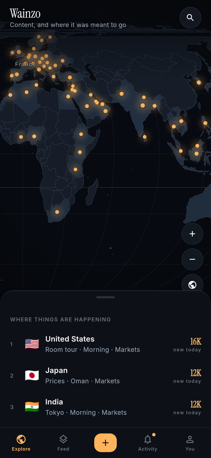
  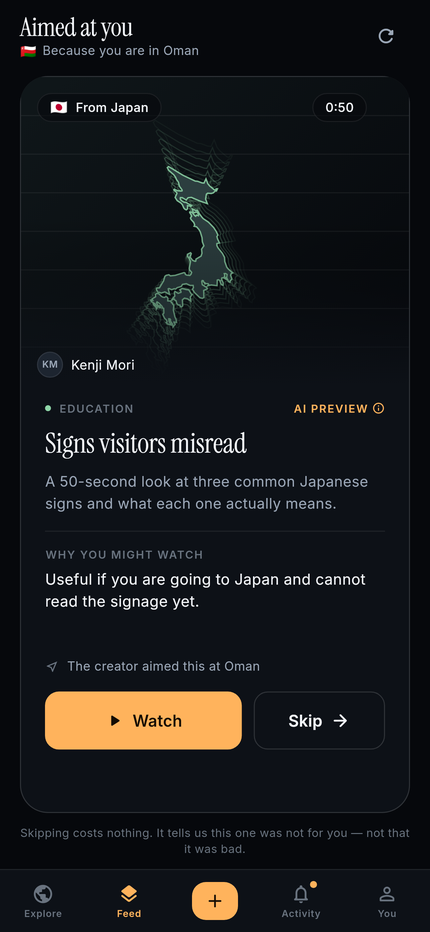
  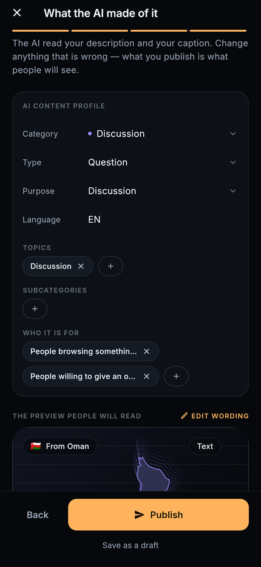
</p>

---

## The idea

Every social network works the same way. You post, an algorithm decides who
sees it, and they watch. The creator has no say in who it reaches, the viewer
has no idea what they are about to watch, and the thumbnail is designed to make
them tap before they know.

Wainzo inverts all three:

| | Traditional feed | Wainzo |
| --- | --- | --- |
| **Who it reaches** | The algorithm decides | The creator names the countries |
| **What you know first** | A thumbnail built to make you tap | A short honest description of what it is |
| **The decision** | You are already watching | Watch, or skip — and skipping is free |

The whole product is one loop:

```
creator picks countries → says what the post is for → AI reads both →
post is filed and a preview is written → the preview reaches people in
those countries → they watch, or they skip → the skip teaches the system
something narrow, and the loop tightens
```

Everything in this project either serves that loop or stays out of the MVP.
That is why there are no direct messages, no stories and no follower
leaderboard in here.

---

## Walking through it

### 1. A world, not a feed

The app opens on the map, centred on the country you are in — because the first
question the product answers is *what is reaching me here*. Countries light up
in proportion to how much content is aimed at them. Pinch, pan, tap a country,
or search for one.

The map is vector and offline: 234 countries in a 111 KB packed binary, drawn
with the app's own Equal Earth projection. No tile server, no API key, no
third-party map SDK. That is what lets a country glow because it holds content
rather than because a tile provider permits an overlay.

<p>
  
  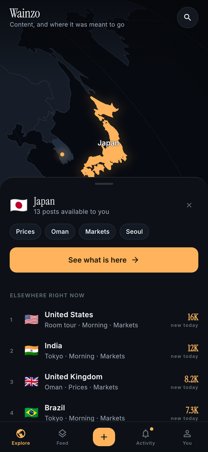
  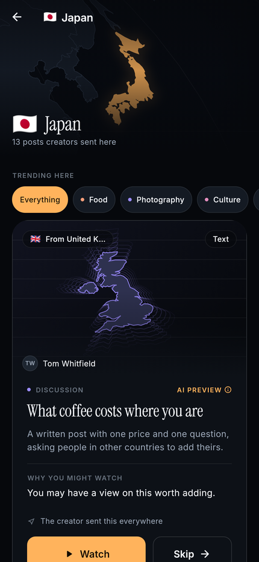
</p>

### 2. The AI preview card

This is the card the whole product turns on. A viewer reads it **instead of**
being shown the content, and then decides.

It does three things and not a fourth: it says what the thing is, it says why
*this particular person* might care, and it makes both answers cheap to act on.
There is no like count on it, no view count and no follower count — nothing
that answers *is this popular* in place of *is this for me*.

It also prints the thing every other feed hides: **why this post is in front of
you.** "The creator aimed this at Oman."

<p>
  
  
  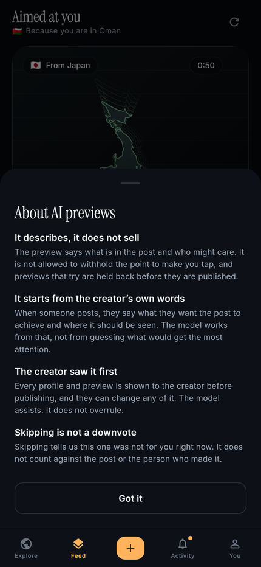
</p>

**Skipping is the cheapest action in the app, and it stays that way.** The next
preview is already built and laid out underneath, so a skip costs one frame —
the card leaving is decoration. Every card carries a link to the terms it was
written under, because someone should never have to guess who wrote the words
they are reading.

### 3. Watching

Full-screen, with as little on top of the content as the job allows. Controls
fade after a couple of seconds; what stays is the progress bar. The AI's
reading of the post is collapsed by default — you already read the preview —
and one tap away when you want to check whether the preview was accurate.

<p>
  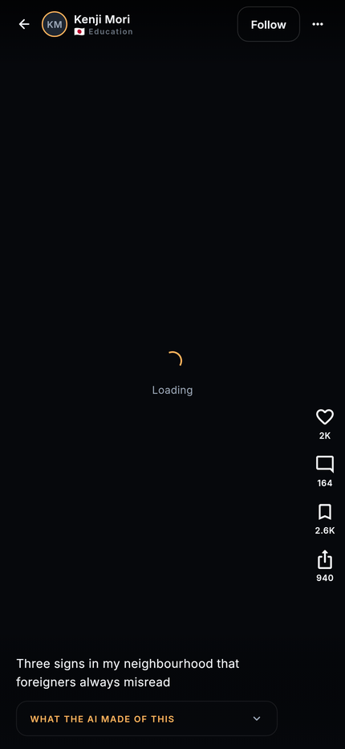
  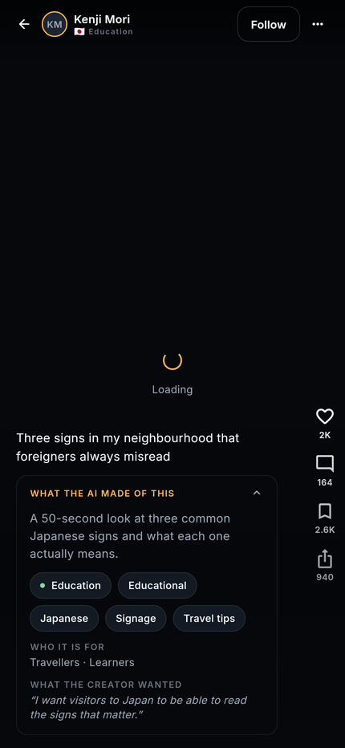
</p>

### 4. Making a post

Four steps, in the order the loop runs: what you made, what you want it to
achieve, where it should go, and what the AI made of it.

The second step is the hinge. It is a paragraph rather than a dropdown, because
*"I want tourists coming to Oman to know what this actually involves"* carries
an audience, a purpose and a tone that no set of tags would — and it is what
the model reasons from.

<p>
  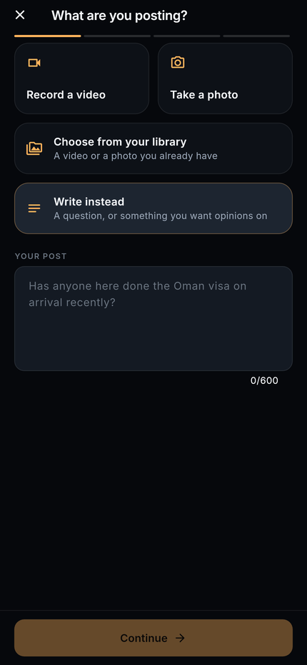
  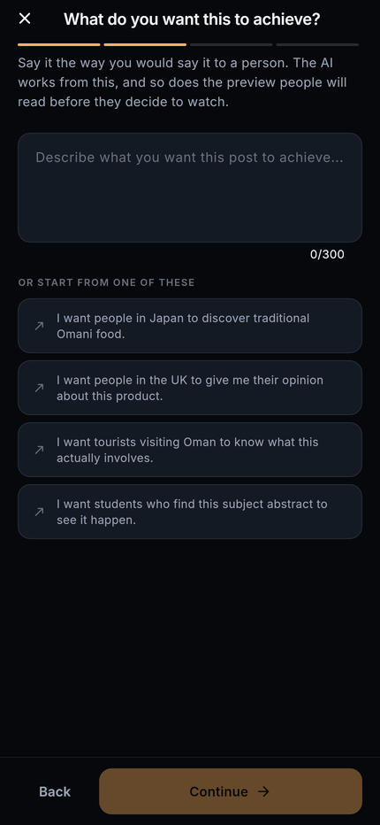
  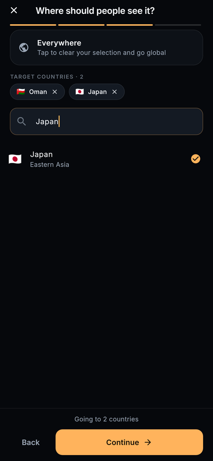
</p>

Then the AI files the post and writes the preview — and hands both back for
approval. **Every field is editable.** The model proposes; the creator
disposes. The card shown for approval is the real one a viewer will meet, not a
mock-up of it.

<p>
  
  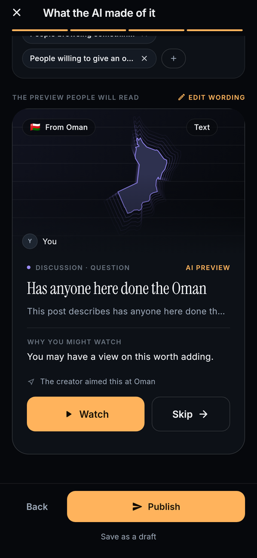
  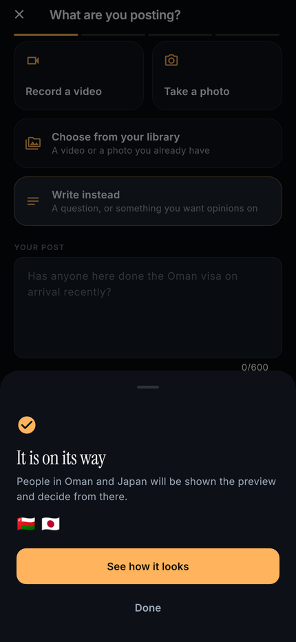
</p>

The confirmation is geographic on purpose: what the creator just decided was a
*place*, so that is what is read back to them.

### 5. Your own map

A creator's identity here is not a follower count — it is a shape on a map.
Activity leads with the thing this product thinks is worth telling someone:
*your post reached Japan.*

And the recommender is readable. Settings shows what discovery has actually
learned about you, in the same words the ranking uses, with a button to delete
it.

<p>
  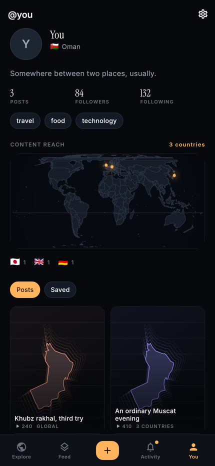
  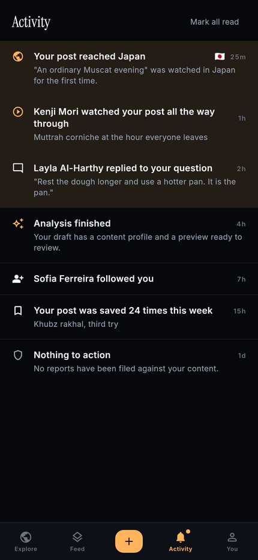
  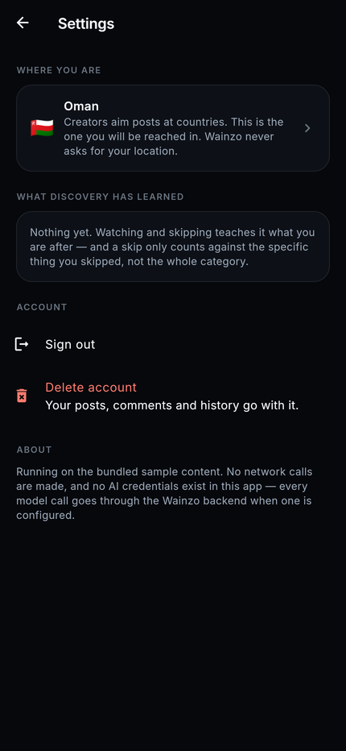
</p>

---

## A skip is not a downvote

This is the part that makes the product different from a feed with a nicer
thumbnail, and it is arithmetic rather than a slogan.

Every interaction is recorded with the **facets** it was about — the category,
the subcategory, the topics, the language, the creator. A negative signal lands
at full strength on the narrow facets and at a fifth of that on the broad ones.

> Skip a luxury-hotel video and `travel/luxury-hotels` drops hard while
> `travel` barely moves. The next travel post still gets shown.

The weights are asymmetric on purpose: a save moves four times as far as a skip
moves back. Skipping is the cheapest action in the app and has to stay cheap to
stay honest — if it cost as much as a save, people would hesitate over it and
the signal would go to noise.

And **likes are not a ranking input at all**. A post with no likes is not
penalised. What "quality" means here is whether the people who chose to watch
*stayed* — which measures whether the preview told the truth, not whether the
post was popular. Completion rate is blended against a prior worth twelve
watches, so a post with three watches is not judged on a three-watch rate and
buried before anyone saw it.

| Ranking term | Weight | |
| --- | --- | --- |
| Creator's targeting | 1.00 | The strongest signal in the system |
| Learned interest | 0.75 | From the facets above |
| Freshness | 0.45 | Two-day half-life; older posts stay reachable |
| Preview honesty | 0.35 | Completion rate against a prior |
| Exploration | 0.30 | A slice that is not optimised at all |
| Likes | — | Not an input |

---

## The preview contract

A preview explains content. It does not sell it. In practice:

- say what the thing is, plainly, including its length;
- say who might care, as a possibility — *"You may be interested if…"* — never
  as a promise;
- no withheld payoff, no dare, no unverifiable superlative.

This is enforced in the app, not just asked for in a prompt. A preview that
trips the check cannot be published, and the creator is told which rule it
broke:

> ❌ *"You won't believe what happens next"* — withholds what the content is
> ✅ *"A 50-second look at three common Japanese signs and what each one
> actually means."*

---

## Run it

```bash
flutter pub get
flutter run
```

No backend, no API key, no signup. The app boots on bundled sample content —
twenty-four posts from thirteen countries, each with a hand-written AI profile
and preview — and every screen is reachable. Sign in with any of the three
buttons; the mock auth service accepts them all.

To point it at a real backend:

```bash
flutter run \
  --dart-define=WAINZO_BACKEND=remote \
  --dart-define=WAINZO_API_BASE_URL=https://api.example.com
```

That swaps every repository for its HTTP implementation. No widget changes.

---

## What is real, and what is standing in

| Real | Standing in |
| --- | --- |
| The map: vector, offline, 234 countries, own projection and hit-testing | — |
| The watch/skip loop, and the signals it writes | — |
| Ranking, including the skip asymmetry | Runs on device against the mock store |
| The composer, end to end, including the honesty check | — |
| The video player | Three bundled placeholder clips stand in for real footage |
| Content model, repositories, HTTP layer | The backend behind them |
| `AiService`, with the full request/response shape | `MockAiService`, a keyword reader, not a model |
| `ModerationService`, called on the publish path | `MockModerationService`, regex rules, not a classifier |
| `AuthService`, all three providers, session persistence | `MockAuthService`; no Google or Apple SDK is linked yet |

Nothing marked "standing in" is faked *around* — each one sits behind the
interface its real version will implement, and the call sites do not change.

**No AI credential exists in this app, and there is no configuration slot for
one.** Model calls go to the Wainzo backend, which holds the provider key and
signs the upstream request.

---

## Structure

```
lib/
├── core/            theme · tokens · routing · network · geo · shared widgets
├── models/          post · user · country · taxonomy · ai profile · signals
├── data/
│   ├── geo/         the bundled map + country registry, and their parsers
│   ├── repositories/  the interfaces every screen talks to
│   ├── mock/        in-memory store, seeded content
│   └── remote/      the HTTP implementations of the same interfaces
├── services/        ai · auth · media · moderation · ranking
├── providers/       composition root, and the session
└── features/        explore · feed · watch · country · create · profile ·
                     activity · settings · auth · map · shell
```

Presentation never reaches past `data/repositories` and `services`. Swapping the
backend means writing new repositories, not touching a widget.

The reasoning behind all of it — why Equal Earth and not Mercator, why the skip
is weighted the way it is, how Apple's rules shaped the auth interface, what is
still standing in — is in [`docs/architecture.md`](docs/architecture.md).

---

## Design

Dark-first, one accent, two typefaces.

- **The map is the product**, so it gets the whole screen and the only
  saturated colour. Amber — the colour of a place lit up on a night map — marks
  the primary action, the active tab and activity on the map. Nothing else.
- **A surface is told apart by a hairline and a tint, never a shadow.** On a
  near-black ground a shadow reads as a smudge.
- **Instrument Serif is reserved for the AI's own sentences** and the figure
  that leads a screen. Inter carries everything else. Keeping the serif rare is
  what makes a preview read as something written rather than generated.
- **Motion is two numbers.** Skip is 170ms and has to feel like nothing
  happened; watch is 420ms and has to feel like the card opened.

A post without media does not get a grey box with a play triangle. Its cover is
its own country's coastline drawn as contour rings, tinted by category —
unique per country, free of licensing, weightless, and it says the one thing
the product is about.

---

## Checks

```bash
flutter analyze   # clean, with infos and warnings fatal
flutter test      # 109 tests
```

The suite is written against the product's claims rather than its code shape:

- `test/models/interest_profile_test.dart` — skipping luxury hotels must not
  bury travel. The discovery philosophy, as arithmetic.
- `test/services/recommendation_test.dart` — likes are not a ranking input, and
  a post with two watches is not judged on a two-watch completion rate.
- `test/features/preview_deck_test.dart` — the next preview is up in the same
  frame the decision was made.
- `test/features/app_boot_test.dart` — boots the real app, signs in, walks every
  tab, and writes and publishes a post through the UI.
- `test/features/layout_audit_test.dart` — walks every screen at three phone
  sizes and fails on any overflow.
- `test/data/world_outlines_test.dart` — runs against the shipped map asset, so
  the generator and the parser cannot drift apart.

### Regenerating the assets

The map and the sample clips are generated, not hand-maintained:

```bash
cd tool
npm pack world-atlas@2 && npm pack world-countries@5 && tar xzf *.tgz
python3 build_map_assets.py countries-50m.json ../assets/data
python3 make_sample_clips.py ../assets/media
```

### Regenerating the screenshots

```bash
flutter test --update-goldens test/screenshots.dart
python3 tool/shrink_screenshots.py
```

Loads the real typefaces and the platform emoji font into the test renderer
first — `flutter test` otherwise draws every string in a placeholder box font.
The one thing it cannot show is video: `video_player` has no implementation in
a headless test, so the watch screen captures its chrome around a loading
state.

---

## Status

This is an MVP built to answer one question: **will people enjoy discovering
content through an honest preview and geographic targeting, instead of through
an algorithmic feed?** Everything is arranged to make that question answerable.

It is not on either store yet. What stands between here and there — signing,
icons, a real auth provider, a moderation provider, a media upload path — is
listed in [`docs/architecture.md`](docs/architecture.md#9-shipping).

No licence yet: the code is public to read, all rights reserved.
